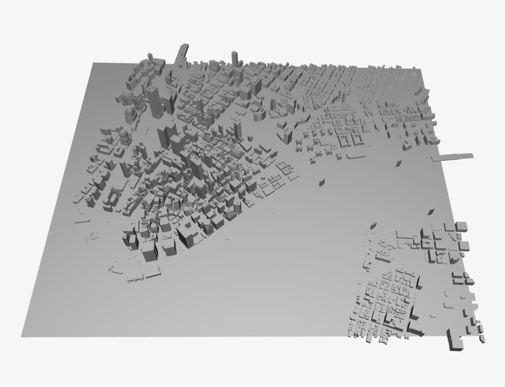

# vectiler

A wavefront obj vector tile builder and exporter based on [mapzen](https://mapzen.com) [vector tiles](https://mapzen.com/projects/vector-tiles).

- build and export mesh in obj files based on tile coordinates (find your tiles of interest [here](http://www.maptiler.org/google-maps-coordinates-tile-bounds-projection/))
- bake ambiant occlusion and save it in an atlas (using [aobaker](https://github.com/prideout/aobaker))


**fetch submodules**

First initialize submodules by running:
```sh
$ git submodule update --init --recursive
```

**install dependecies (OS X)**

aobaker needs [embree](https://embree.github.io/) for optimal ray tracing and tbb, you can install it using [homebrew](http://brew.sh/):

```sh
$ cp 3rdparty/aobaker/embree.rb /usr/local/Library/Formula
$ brew install embree tbb cmake
```

**build**

To build with cmake in a `build/` directory run the following:
```sh
$ cmake . -Bbuild
$ cmake --build build
```

**usage**

```
  Usage: ./objexport [options]

  Options:
    --name         File name ((null))
    --splitMeshes  Generate one mesh per feature in wavefront file (0)
    --tilex        Tile X (19294)
    --tiley        Tile Y (24642)
    --tilez        Tile Z (16)
    --offsetx      Tile Offset on X coordinate (0.0)
    --offsety      Tile Offset on Y coordinate (0.0)
    --bakeAO       Generate ambiant occlusion baked atlas (0)
    --append       Append the obj to an existing obj file (0)
    --sizehint     Controls resolution of atlas (512)
    --nsamples     Quality of ambient occlusion (256)
    --version      Output version
    --help         Output help
```

**example**

Download one tile with ambiant occlusion baked in a texture:
```sh
./objexport --tilex 19294 --tiley 24642 --tilez 16 --sizehint 512 --nsamples 128
```
Output files are:
- `[tilex].[tiley].[tilez].obj`: a simple mesh containing coordinates and normals
- `[tilex].[tiley].[tilez]-ao.obj`: a mesh containing coordinates and texture uvs for ambiant occlusion rendering
- `[tilex].[tiley].[tilez].png`: an atlas containing the baked ambiant occlusion

Download a _big_ tile, in a file named `manhattan.obj` from a shell script:
```sh
#!/bin/bash

offsetx=0
for x in {19293..19298}
do
    offsetx=$((offsetx+2))
    offsety=0
    for y in {24639..24643}
    do
        offsety=$((offsety-2))
        # --append option will append results to manhattan.obj
        # --offsetx and --offsety will offset the vertices of appended objs
        ./objexport --name manhattan --tilex $x --tiley $y --tilez 16 --offsetx $offsetx --offsety $offsety --append 1
    done
done
```



**build and run the viewer (OS X)**

A minimal viewer using [oglw](https://github.com/karimnaaji/oglw) can be used to preview the obj tiles:

```sh
$ cd renderer
$ cmake . -Bbuild
$ cmake --build build
$ open viewer.app --args ~/dev/obj-export/build/19294.24642.16-ao.obj ~/dev/obj-export/build/19294.24642.16.png
```

